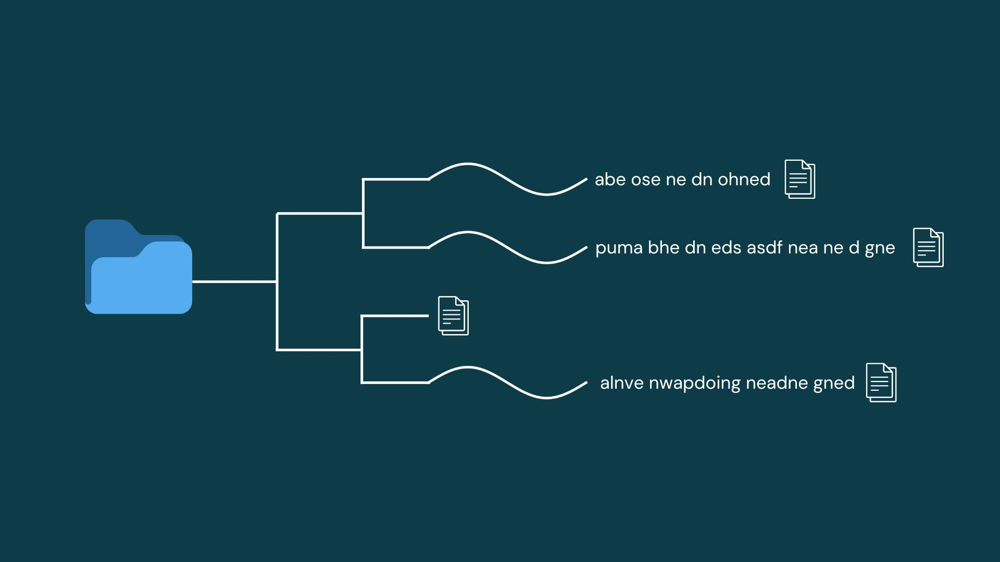

# Speechmatics MCP Server for Claude Code



An MCP (Model Context Protocol) server that gives Claude Code the ability to transcribe audio and video files using the [Speechmatics Batch API](https://www.speechmatics.com/).

## What This Does

Once installed, Claude Code gains access to transcription tools that allow you to:

- **Transcribe single files** - Convert any audio/video file to text
- **Batch transcribe directories** - Process entire folders of media files in parallel
- **Speaker diarization** - Identify different speakers (S1, S2, etc.) in conversations
- **Search transcripts** - Use Claude's native Grep tool to search across all your transcripts

Example usage in Claude Code:
```
"Transcribe the meeting recording at ~/Downloads/meeting.mp4"
"Transcribe all the podcasts in ~/Podcasts with speaker identification"
"Search my transcripts for mentions of 'quarterly budget'"
```

## Requirements

- Python 3.11+
- ffmpeg (for audio duration detection)
- [Speechmatics API key](https://portal.speechmatics.com/) (free tier available)

## Installation

### 1. Install ffmpeg

```bash
# macOS
brew install ffmpeg

# Ubuntu/Debian
sudo apt install ffmpeg

# Windows
winget install ffmpeg
```

### 2. Clone and install dependencies

```bash
git clone https://github.com/ArchieMcM234/speechmatics_claude_code_mcp.git
cd speechmatics_claude_code_mcp
uv sync
```

### 3. Register the MCP server

Add to your Claude Code config file (`~/.claude.json`):

```json
{
  "mcpServers": {
    "transcription": {
      "command": "uv",
      "args": [
        "--directory",
        "/path/to/speechmatics_claude_code_mcp",
        "run",
        "python",
        "server.py"
      ],
      "env": {
        "SPEECHMATICS_API_KEY": "your-api-key-here"
      }
    }
  }
}
```

Replace `/path/to/speechmatics_claude_code_mcp` with the actual path where you cloned the repo.

**Note:** Setting the API key in the `env` block is all you need. You don't need to export it separately or create a `.env` file.

### 4. Restart Claude Code

The transcription tools will now be available.

## Available Tools

### transcribe_file

Transcribe a single audio/video file.

| Parameter | Type | Default | Description |
|-----------|------|---------|-------------|
| `file_path` | string | *required* | Absolute path to the media file |
| `accuracy` | string | `"standard"` | `"standard"` or `"enhanced"` (enhanced costs more but is more accurate) |
| `diarize` | boolean | `false` | Enable speaker diarization to identify different speakers |
| `with_timestamps` | boolean | `false` | Include word-level timestamps (outputs JSON instead of TXT) |
| `force` | boolean | `false` | Re-transcribe even if a transcript already exists |

### transcribe_directory

Transcribe all media files in a directory with parallel processing.

| Parameter | Type | Default | Description |
|-----------|------|---------|-------------|
| `directory` | string | *required* | Path to directory containing media files |
| `file_types` | array | `["mp3", "mp4", "wav", ...]` | File extensions to include |
| `accuracy` | string | `"standard"` | `"standard"` or `"enhanced"` |
| `diarize` | boolean | `false` | Enable speaker diarization |
| `with_timestamps` | boolean | `false` | Include word-level timestamps |
| `force` | boolean | `false` | Re-transcribe even if transcripts exist |
| `recursive` | boolean | `false` | Search subdirectories |
| `max_concurrent` | integer | `10` | Maximum parallel transcription jobs (1-50) |

### get_transcript

Read an existing transcript file.

| Parameter | Type | Description |
|-----------|------|-------------|
| `file_path` | string | Path to media file OR transcript file |

### get_usage

Get Speechmatics API usage statistics for the current month. No parameters required.

## Output Formats

Transcripts are saved alongside the original media file.

### Plain text (default): `filename.transcript.txt`

```
# Transcribed: 2024-01-30T14:32:00Z
# Source: meeting.mp4
# Duration: 12:34
# Accuracy: standard
# Diarization: true

S1: Hello everyone, welcome to the meeting.
S2: Thanks for having me.
...
```

### JSON with timestamps: `filename.transcript.json`

```json
{
  "metadata": {
    "source": "meeting.mp4",
    "transcribed_at": "2024-01-30T14:32:00Z",
    "duration_seconds": 754,
    "accuracy": "standard",
    "diarization": true
  },
  "transcript": "S1: Hello everyone...",
  "words": [
    {"word": "Hello", "start": 0.0, "end": 0.5, "confidence": 0.98}
  ]
}
```

## Searching Transcripts

After transcribing, Claude can use its native Grep tool to search across all transcripts:

```
"Search all transcripts in ~/meetings for mentions of 'project deadline'"
"Find where we discussed the budget in the Q4 recordings"
```

## License

MIT
